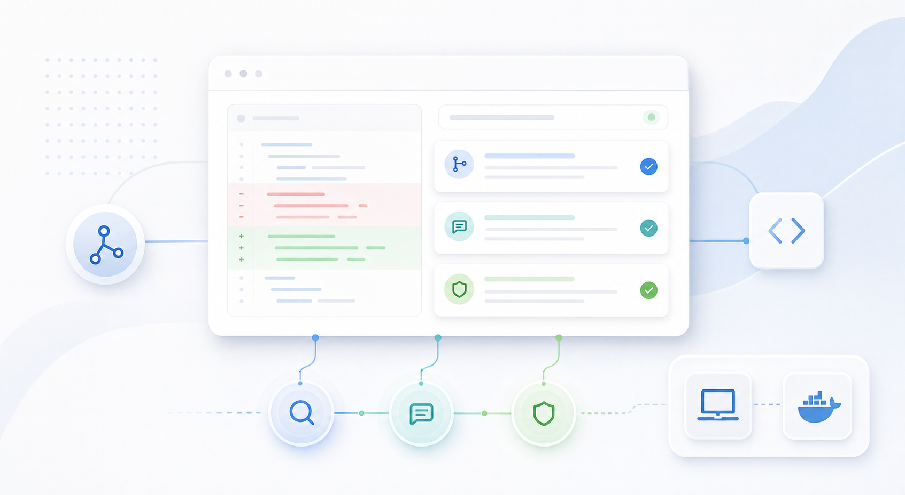
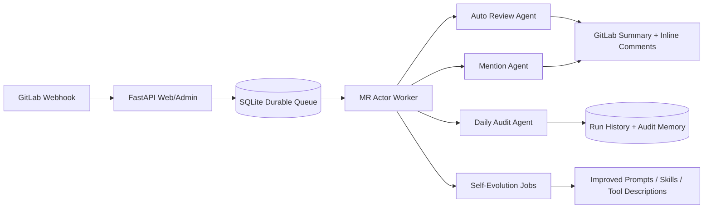
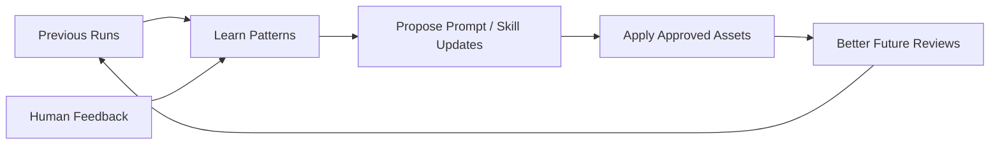
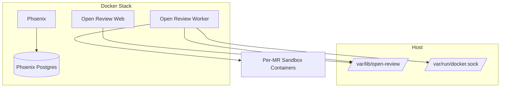

# Open Review

<p align="center">
  
</p>

<p align="center">
  <a href="#local-uv-deployment"></a>
  <a href="#docker-stack-deployment"></a>
  <a href="#agents"></a>
  <a href="#self-evolution"></a>
  <a href="#configuration"></a>
</p>

Open Review automatically reviews potential issues in GitLab merge requests, supports interactive `@bot` conversations, and runs scheduled daily code audits for general software repositories.

It can run directly with `uv` or as a bundled Docker stack. Runtime settings are managed from the built-in admin console, and review work runs in isolated worktrees across mixed-language projects.

## At A Glance

| Area | What Open Review Provides |
| --- | --- |
| Merge request review | Automatic MR review on open, reopen, update, and draft-to-ready events |
| Interactive assistance | `@<bot-username>` mention handling for questions, explanations, and bounded code changes |
| Scheduled audit | Daily project-level audit for focused workflow risks |
| Execution model | Durable SQLite queue, one active run per MR, parallel processing across different MRs |
| Sandboxing | Per-run temporary worktrees with local or Docker-backed execution |
| Operations | Built-in `/admin` console, run history, configuration, and bilingual UI |
| Observability | Optional Phoenix tracing for agent and run debugging |
| Improvement loop | Globally controlled self-evolution for prompts, skills, and tool descriptions |

## Runtime Flow



The webhook server validates incoming GitLab events and enqueues work. A worker process handles review, mention, audit, and self-evolution jobs. Runs for the same merge request are serialized, while different merge requests can run in parallel.

## Agents

| Agent | Trigger | Main Job | Output |
| --- | --- | --- | --- |
| Auto Review | MR open, reopen, update, draft-to-ready | Review mixed-language changes with specialist focus on correctness, reliability, contracts, performance/build behavior, and security | Structured MR summary plus inline comments for high-confidence findings |
| Mention | MR comment containing the bot mention | Answer questions, inspect context, explain behavior, or make bounded code changes | GitLab reply, and optionally a pushed commit after safety checks |
| Daily Audit | Scheduled project-level run | Choose one focused workflow area and investigate it in depth | Findings, continuity notes, and audit memory for later runs |

### Auto Review Agent

The Auto Review Agent focuses on merge request risk. It can inspect diffs, repository context, tests, build files, and adjacent code paths before publishing feedback.

### Mention Agent

The Mention Agent is the interactive assistant. It can answer review questions, explain implementation details, trace behavior, and make small code changes when asked. Code changes are made in a temporary worktree and checked against the current MR head before push.

### Daily Audit Agent

The Daily Audit Agent runs outside a single MR. It is useful for recurring project hygiene, workflow-level risk discovery, and continuity across multiple audit runs.

## Self-Evolution

Open Review can improve its own agent behavior over time for `auto_review`, `mention`, and `daily_audit`.



- Each agent has its own enable flag, interval in days, and fixed local schedule.
- It learns from previous runs, feedback, and persisted run history.
- It can propose improvements to review prompts, skills, and tool descriptions.
- It runs independently from normal webhook handling.
- Manual triggers are available per agent from the admin console.

## Deployment Options

| Mode | Best For | What Runs Locally |
| --- | --- | --- |
| Local `uv` | Development, testing, small single-host installs | Web process, worker process, SQLite state, optional local or Docker sandbox |
| Docker stack | Packaged single-host deployment with Docker sandboxing | Web container, worker container, Phoenix, Postgres, sandbox image |

Both modes use `/var/lib/open-review` for durable application state.

## Local `uv` Deployment

Install dependencies:

```bash
uv sync
```

Prepare the fixed state directory if this is the first local run:

```bash
sudo install -d -o "$(id -un)" -g "$(id -gn)" -m 0750 /var/lib/open-review
```

Start the webhook/admin server:

```bash
uv run python -m uvicorn agent.webapp:app --host 0.0.0.0 --port 8000 --reload
```

Start the worker in a second terminal:

```bash
uv run python -m agent.runtime.worker
```

Open the admin console:

```text
http://localhost:8000/admin
```

On first boot, create the initial admin password. Then configure GitLab, model provider settings, webhook URL, scheduling, sandbox mode, and optional tracing from the admin UI.

For local GitLab webhook testing, expose the server with a tunnel:

```bash
cloudflared tunnel --url http://localhost:8000
```

Local deployment features:

- Runs web and worker as normal host processes.
- Uses `/var/lib/open-review` for the control-plane database, project cache, local sandboxes, and runtime artifacts.
- Supports `SANDBOX_TYPE=local` for trusted development workflows.
- Supports `SANDBOX_TYPE=docker` when Docker execution isolation is needed.
- Can share state with Docker stack deployment.

## Docker Stack Deployment

Run:

```bash
cd deploy/stack
./deploy.sh
```

The stack starts:

- Open Review `web`
- Open Review `worker`
- Phoenix
- Phoenix Postgres
- the Docker sandbox image used by the worker



Mutable state is stored under `/var/lib/open-review`. `deploy.sh` validates that directory before startup and can repair ownership with `sudo` in an interactive shell.

Before deployment, or when debugging host setup, run:

```bash
cd deploy/stack
./doctor.sh
./doctor.sh --fix
```

The doctor checks Docker access, state directory permissions, common port conflicts, and optionally Docker build network access with `OPEN_REVIEW_DOCTOR_CHECK_APT=1`.

## Configuration

Business configuration is admin-first. The application starts with code defaults, then reads runtime overrides from the control-plane database. A repository-root `.env` is not required for normal operation.

The most important settings are:

| Setting | Purpose |
| --- | --- |
| `GITLAB_API_URL` | GitLab API and git remote base URL used by the service |
| `GITLAB_EXTERNAL_URL` | Browser-facing GitLab URL |
| `GITLAB_TOKEN` | Dedicated bot account token |
| `GITLAB_WEBHOOK_SECRET` | Shared webhook validation secret |
| `GITLAB_TARGET_PROJECTS` | Projects for webhook setup |
| `OPEN_REVIEW_EXTERNAL_URL` | Externally reachable URL GitLab uses to call Open Review |
| `LLM_ACTIVE_PROVIDER` | `openai` or `anthropic` |
| `OPENAI_BASE_URL`, `OPENAI_API_KEY`, `OPENAI_MODEL` | OpenAI-compatible provider settings |
| `ANTHROPIC_BASE_URL`, `ANTHROPIC_API_KEY`, `ANTHROPIC_MODEL` | Anthropic-compatible provider settings |
| `SANDBOX_TYPE` | `local` or `docker` |
| `DOCKER_IMAGE` | Sandbox image used when Docker sandboxing is enabled |
| `PHOENIX_TRACING_ENABLED` | Optional tracing switch |

See [.env.example](.env.example) for deployment-level examples. Do not commit real tokens or secrets.

## Optional Phoenix Tracing

Phoenix is optional and fail-open. If it is unavailable or disabled, webhook processing and worker runs continue normally.

Start Phoenix from the bundled assets:

```bash
cd deploy/phoenix
cp .env.example .env
docker compose up -d
```

Then configure these values in the admin console:

```text
PHOENIX_TRACING_ENABLED=true
PHOENIX_COLLECTOR_ENDPOINT=http://localhost:6006/v1/traces
PHOENIX_UI_BASE_URL=http://localhost:6006
PHOENIX_PROJECT_NAME=open-review
```

## Testing

Install development dependencies and run tests:

```bash
uv sync --extra dev
uv run python -m pytest tests/ -v
```

For a quick syntax check:

```bash
uv run python -m compileall agent tests
```

## Repository Layout

- `agent/webapp.py`: FastAPI app and GitLab webhook endpoint.
- `agent/runtime/`: durable queue, stores, run models, and worker loop.
- `agent/scenes/auto_review/`: automatic merge request review workflow.
- `agent/scenes/mention/`: mention-driven assistant workflow.
- `agent/scenes/daily_audit/`: scheduled project-level audit workflow.
- `agent/admin/`: built-in admin console.
- `agent/gitlab/`: GitLab API helpers.
- `agent/sandbox/`: local and Docker sandbox helpers.
- `deploy/`: optional deployment assets.
- `tests/`: unit and integration-style tests.

## Security Notes

- Use a dedicated GitLab bot account with the minimum permissions needed for the target projects.
- Keep API keys, webhook secrets, and admin passwords out of Git history.
- Prefer Docker sandboxing for untrusted or multi-project review workloads.
- Review generated comments and commits before using the bot in repositories with sensitive code.
